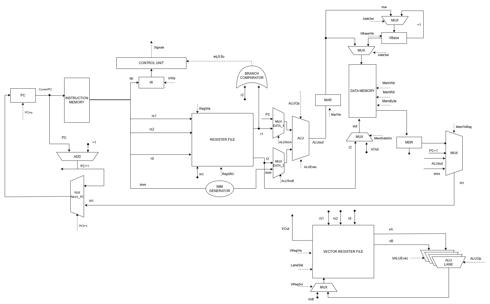
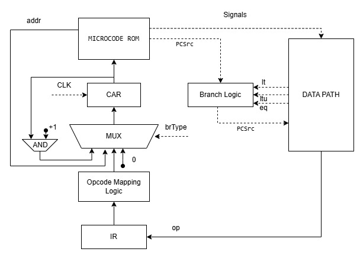

# Лабораторная работа №4. Эксперимент

- ФИО: **Кантунья Жан Карло**
- Группа: **P3220**
- Вариант:

```text
alg | risc | harv | mc | tick | binary | stream | mem | pstr | prob1 | vector
```

## Table of Contents

- [Язык программирования](#язык-программирования)
- [Организация памяти](#организация-памяти)
- [Система команд](#система-команд)
- [Vector extension](#vector-extension)
- [Транслятор](#транслятор)
- [Модель процессора](#модель-процессора)
- [Тестирование](#тестирование)
- [Пример использования инструментальной цепочки](#пример-использования-инструментальной-цепочки)

---

## Язык программирования

### Общая характеристика

В проекте реализован JavaScript-подобный язык с C-подобным синтаксисом. 
Программа состоит из функций, каждая функция — из последовательности операторов, 
разделённых точкой с запятой. Поддерживаются объявления переменных, присваивания, 
условные операторы, циклы, вызовы встроенных функций, массивы, строки в формате pstr 
и векторные операции для массивов фиксированной длины.

Язык поддерживает:

- объявления переменных `let` (с возможной инициализацией);
- присваивания;
- составной оператор (`block`);
- условный оператор `if` / `else`;
- циклы `while`;
- определения функций `function` (пользовательские функции без параметров, но встроенные функции могут принимать аргументы);
- оператор `halt;` для остановки модели;
- встроенные функции `print(int)`, `print_str(string)`, `read()`, `readln(string)`;
- литералы: целые числа, шестнадцатеричные числа, символы, строки, `true`, `false`;
- арифметические, побитовые, логические и операторы сравнения с обычным приоритетом C;
- короткое замыкание `&&` и `||` на этапе трансляции.

Транслятор (`src/hl_logic.py`) реализует подмножество грамматики, достаточное для написания учебных программ, и компилирует исходник в текстовое ассемблерное представление, которое затем ассемблируется в бинарный образ.

### Синтаксис (BNF)

```bnf
<comment>      ::= "//" <any-char>* <newline>
<identifier>   ::= [a-zA-Z_][a-zA-Z0-9_]*
<number>       ::= [0-9]+
<hex-number>   ::= "0x" [0-9a-fA-F]+
<char>         ::= "'" <print-char> "'"
<string>       ::= '"' <print-char>* '"'
<separator>    ::= "{" | "}" | "(" | ")" | "[" | "]" | ";" | ","

<program>      ::= <function>*

<var-decl>     ::= "let" <identifier> ("[" <expr> "]")? ("=" <expr>)?

<function>     ::= "function" <identifier> "(" ")" <block>

<block>        ::= "{" <statement>* "}"

<statement>    ::= <var-decl> ";"
                 | <assignment> ";"
                 | <if-stmt>
                 | <while-stmt>
                 | <return-stmt> ";"
                 | <call-stmt> ";"
                 | <block>
                 | "halt" ";"
                 | ";"

<assignment>   ::= <identifier> ("[" <expr> "]")* "=" <expr>

<if-stmt>      ::= "if" "(" <expr> ")" <statement> ("else" <statement>)?

<while-stmt>   ::= "while" "(" <expr> ")" <statement>

<return-stmt>  ::= "return" <expr>?

<call-stmt>    ::= <identifier> "(" <arg-list>? ")"

<expr>         ::= <literal>
                 | <identifier>
                 | <unary-op> <expr>
                 | <expr> <binary-op> <expr>
                 | <identifier> "(" <arg-list>? ")"
                 | <identifier> ("[" <expr> "]")+
                 | "{" <arg-list>? "}"
                 | "(" <expr> ")"

<literal>      ::= <number> | <hex-number> | <char> | <string> | "true" | "false"

<arg-list>     ::= <expr> ("," <expr>)*

<unary-op>     ::= "-" | "~" | "!"

<binary-op>    ::= "+" | "-" | "*" | "/" | "%"
                 | "<<" | ">>"
                 | "&" | "|" | "^"
                 | "==" | "!=" | "<" | ">" | "<=" | ">="
                 | "&&" | "||"
```

### Семантика

#### Стратегия вычислений

- используется **eager evaluation**: аргументы выражений вычисляются до применения операции;
- `if` вычисляет только выбранную ветвь;
- `&&` и `||` имеют short-circuit семантику: правый операнд не вычисляется, если результат уже определён;
- `while` повторно вычисляет условие и выполняет тело, пока условие истинно;
- `function` вводит новую область видимости;
- `halt;` останавливает модель процессора;
- `len(arr)` — возвращает количество элементов массива (известно на этапе компиляции).

#### Области видимости

- программная единица — функция; глобальной видимости нет;
- переменные, объявленные через `let`, видны только внутри блока, в котором они объявлены, и во вложенных блоках;
- имя переменной должно быть объявлено до первого использования;
- параметры функций в текущей реализации не поддерживаются (используется `function main()`).

#### Типизация

Язык использует статическую строгую типизацию. Поддерживаются два основных представления данных: 
целые числа `int` и статические массивы `int[]`. Строки не являются отдельным типом и хранятся 
как массивы `int[]` в формате `pstr`.

#### Виды литералов

| Литерал          | Тип значения | Пример          |
|------------------|--------------|------------------|
| численный        | `int`        | знаковое 32-бит целое от -2147483648 до 2147483647 |
| символьный       | `int`        | `'A'`, `'\n'`, `'\t'` (одиночный ASCII с поддержкой спец-символов) |
| строковый        | `int[]`      | `"Hello, world!"` — набор символьных литералов в кавычках, подчиняющийся правилам символьных |
| логические       | `int`        | `true` (1), `false` (0) |
| массив           | `int[]`      | `{1, 2, 3}` — фигурные скобки, элементы через запятую |

Строки **не имеют отдельного типа данных** и рассматриваются как объявления типа `int[]`.

#### Массивы

Язык поддерживает статические одномерные массивы `int[]`. Массивы размещаются в `gp`-относительной памяти данных. Доступ к элементам осуществляется через индексацию в квадратных скобках.

**Объявление массивов:**

```javascript
// Массив с инициализацией из литерала (размер определяется количеством элементов)
let arr = {10, 20, 30, 40, 50};

// Массив с указанием размера (все элементы обнуляются)
let buf[256];

// Массив с указанием размера и частичной инициализацией
let data[10] = {1, 2, 3};
```

**Доступ к элементам:**

```javascript
let x = arr[0];       // чтение элемента
arr[1] = 99;          // запись элемента
let i = 2;
let y = arr[i];       // индекс может быть переменной
arr[i + 1] = 42;      // индекс может быть выражением
```

**Статические операции над массивами:**

При применении бинарных операторов (`+`, `-`, `*`, `/`) к двум массивам одинакового размера компилятор генерирует векторные инструкции (`VLD`/`VADD`/`VST` и т.д.), обрабатывающие 4 элемента за раз (SIMD). Результат сохраняется в новый массив.

```javascript
let a = {1, 2, 3, 4};
let b = {5, 6, 7, 8};
let c = a + b;  // генерирует VLD / VADD / VST — c = {6, 8, 10, 12}
```

#### Пример программы

```javascript
// Печатает числа от 0 до 9, затем перевод строки
function main() {
    let i = 0;
    while (i < 10) {
        print(i + 48);
        i = i + 1;
    }
    print(10);
    halt;
}
```

Транслятор генерирует следующий ассемблер (см. `examples/count.asm`):

```asm
    .org 0
    J main
data_start:
    main:
    ADDI gp, zero, data_start
    MV s0, zero
    w_1:
    ADDI t0, zero, 10
    BGE s0, t0, ew_2
    ADDI t1, s0, 48
    LUI t2, 0
    ADDI t2, t2, -12
    SW t1, t2, 0
    ADDI s0, s0, 1
    J w_1
    ew_2:
    ADDI t3, zero, 10
    LUI t4, 0
    ADDI t4, t4, -12
    SW t3, t4, 0
    HALT
```

#### Примеры других программ

- `examples/hello.alg` — печатает `Hello, World!` через `print_str`;
- `examples/sum.alg` — складывает два числа и печатает ASCII-цифру;
- `examples/prob1.alg` — решает Project Euler №1 (сумма кратных 3 или 5 до 999);
- `examples/prob1_optimized.alg`, `examples/prob1_bruteforce.alg` — два варианта той же задачи.

---

## Организация памяти

### Общая модель

Используется **гарвардская архитектура** (вариант `harv`): память инструкций и память данных физически разделены. Машинное слово — 32 бита. Адресация — пословная, выровненная.

Параметры памяти:

- машинное слово: 32 бита;
- инструкция: 32 бита фиксированной длины;
- адресация словная, alignment 4 байта;
- размер памяти данных: 8192 слова (см. `DATA_MEM_SIZE` в `src/isa.py:32`);
- база стека: `0x1000` (`STACK_BASE`), стек растёт вниз;
- память инструкций (instruction memory): word-addressable, адрес = PC, начинается с `0`;
- ввод-вывод реализован через memory-mapped I/O (вариант `stream`).

### Регистры

#### Скалярные регистры (32 × 32 бита)

| Алиас   | Номер | Назначение                  |
|---------|------:|------------------------------|
| `zero`  | 0     | всегда 0                    |
| `ra`    | 1     | адрес возврата              |
| `sp`    | 2     | указатель стека             |
| `gp`    | 3     | глобальный указатель        |
| `a0..a7`| 4..11 | аргументы / возврат значения|
| `t0..t5`| 12..17| временные                   |
| `s0..s1`| 18..19| сохраняемые, frame-base     |
| `s2..s11`|20..29| сохраняемые                 |
| `t6`    | 30    | временный                   |
| `tp`    | 31    | резерв                      |

#### Vector-регистры (8 × 128 бит, вариант `vector`)

| Алиас | Размер         | Назначение                                          |
|-------|----------------|------------------------------------------------------|
| `V0..V7` | 4 lane × int32 | vector register file для VLD/VST и lane-wise ALU  |

Служебные регистры datapath, используемые vector-расширением:

| Регистр/блок       | Назначение                                                    |
|--------------------|---------------------------------------------------------------|
| `VectorBaseRegister` (`vbase`) | базовый адрес текущего `VLD`/`VST`                 |
| `LaneCounterRegister`         | (в данной реализации — комбинационный)            |
| `LaneOffsetShifter`           | `lane` (комбинационный)                            |
| `VectorLaneAddressAdder`      | `vbase + lane`                                                  |
| `LaneComparator`              | проверка последнего lane                          |

### Разбиение адресного пространства

#### Instruction memory

```text
0x0000  +------------------------+
        | program start          |
        |   .org 0               |
        |   J main               |
        |   main: ...            |
        |   user functions       |
        |   generated helpers    |
        |   ...                  |
        +------------------------+
```

Инструкции располагаются в порядке эмиссии; адрес инструкции = её индекс в этом массиве. PC увеличивается на `+1` за такт (а не на `+4`, потому что адресация пословная).

#### Data memory

```text
0x0000  +------------------------+
        | литералы, статические  |
        | данные программы       |
        | (.word, .string)       |
        |                        |
        |  gp-относительная глобальная |
        |  variables (data_start)|
        |                        |
0x1000  +------------------------+
        | stack (растёт вниз)    |
        |   ...                  |
        |   saved ra, locals     |
0xFFFFFFF0  +------------------------+
         | IN_PORT  (read-only)   |
0xFFFFFFF4  +------------------------+
         | OUT_PORT (write-only)  |
         +------------------------+
```
 
#### Memory-mapped I/O (вариант `stream`)
 
| Адрес        | Имя       | Доступ     | Назначение                              |
|--------------|-----------|------------|------------------------------------------|
| `0xFFFFFFF0` | `IN_PORT` | read-only  | MMIO: читает следующий байт из входного потока |
| `0xFFFFFFF4` | `OUT_PORT`| write-only | MMIO: пишет младший байт в выходной поток      |
 
Эти адреса являются memory-mapped I/O и не принадлежат обычной памяти данных. Запись в `IN_PORT` или чтение из `OUT_PORT` в модели не приводит к ошибке, но и не имеет наблюдаемого эффекта. В ассемблере адреса `IN_PORT`/`OUT_PORT` указываются как `0xFFF0`/`0xFFF4` — 11-битный immediate автоматически знаково-расширяется процессором до полного 32-битного адреса.

### Формат строк `pstr` (вариант `pstr`)

Строка хранится как последовательность 32-битных слов:

```text
addr + 0  : length
addr + 1  : char[0]
addr + 2  : char[1]
...
```

Каждый символ занимает одно машинное слово; `length` хранит количество символов. Директива `.string "Hello"` в ассемблере автоматически разворачивается в 6 слов.

### Механика отображения объектов языка на память

**Литералы.** Малый целый/шестнадцатеричный литерал (`-1024..1023`) кодируется как 11-битный immediate в `ADDI`; литерал вне этого диапазона разворачивается в `LUI` + `ADDI`. Символьный литерал `'<c>'` — это `int` со значением `ord(c)`. Логические `true`/`false` — `1` / `0`. Строковый литерал в `print_str` сохраняется в `.data` как `pstr` (`length` + слова символов, ровно `1 + len` слов) и выделяется последовательно в порядке первого использования.

**Константы.** В текущей реализации HL отдельных `const`-объявлений нет — их роль исполняют литералы. В `.asm` они могут быть объявлены через `.word` в любой секции.

**Переменные.** Распределение делается в `src/hl_logic.py` (`_var_loc`, `_load_var`): первые 12 имён попадают в скалярные регистры `s0..s11` напрямую; всё, что сверх, отображается в `gp`-относительную память данных по одному слову (`SW gp, off` / `LW rd, gp, off`). Поддержка стека с локальными переменными (`sp`-относительно) предусмотрена архитектурой, но в текущей реализации HL не используется (единственная функция `main`).

**Инструкции.** Кодируются ассемблером в 32-битные слова и располагаются в `.text` начиная с адреса 1 (после `J main` по адресу 0). Метки разрешаются за два прохода: `ADDI` с известным immediate — одна строка, переходы по меткам — после второго прохода.

**Процедуры.** `function main()` — единственная точка входа; `JAL` пока не используется. Runtime-процедуры (`print_str`, цикл печати) компилируются inline.

**Прерывания (вариант `stream`).** Прерываний и trap-механизма нет. Ввод-вывод синхронный: `IN_PORT` возвращает следующий байт из входного буфера модели (или `0`, если буфер пуст); `OUT_PORT` дописывает байт в выходной буфер.

---

## Система команд

### Особенности процессора

- **RISC** ISA (load/store): арифметика работает только над регистрами, память доступна только через `LW`/`LB`/`SW`/`SB`/`LUI`.
- **Harvard** (вариант `harv`): инструкции и данные в разных адресных пространствах.
- **Фиксированная длина** инструкции: 32 бита.
- **Микрокодированная** CU (вариант `mc`): горизонтальная µROM с 29 сигналами.
- **Tick-accurate** (вариант `tick`): каждый вызов `tick()` моделирует ровно одну µROM-стадию.
- **Двоичное** представление (вариант `binary`): выход ассемблера — поток 32-битных little-endian слов.
- **Stream I/O** (вариант `stream`): `IN_PORT`/`OUT_PORT` в memory map.
- **Memory + Pascal strings** (`mem`/`pstr`): `pstr`-формат хранения строк в data memory.
- **Vector extension** (вариант `vector`): 8 векторных регистров по 4 lane × int32.

### Форматы инструкций

Все инструкции имеют длину 32 бита.

| Формат | Назначение                                                  |
|--------|--------------------------------------------------------------|
| R      | регистр-регистр арифметика                                  |
| I      | immediate, `LW`/`LB`                                        |
| S / I* | `SW`/`SB` (физически I-type, `rd` переиспользован как `rs2`)   |
| B      | условные переходы                                            |
| U      | `LUI` (загрузка верхней части immediate)                    |
| J      | `J` (безусловный переход)                                   |
| JL     | `JAL` (переход с сохранением PC+1 в регистр)               |
| JR     | `JR` (косвенный переход через регистр)                      |
| V      | Vector ALU (`VADD`/`VSUB`/`VMUL`/`VDIV`/`VCMP`)             |
| VL     | Vector Load/Store (`VLD`/`VST`)                             |
| —      | `HALT` (опкод без операндов)                                |

#### R-type

```text
    31      26 25    21 20    16 15    11 10         0
   +--------+--------+--------+--------+-----------+
   | opcode |   rd   |  rs1   |  rs2   |     0     |
   +--------+--------+--------+--------+-----------+
   |  6 бит |  5 бит |  5 бит |  5 бит |   11 бит  |
```

Используют: `ADD`, `SUB`, `MUL`, `DIV`, `REM`, `MULH`, `AND`, `OR`, `XOR`, `NOT`, `SLL`, `SRL`, `SRA`, `SLT`, `NOP`.

#### I-type

```text
    31      26 25    21 20    16 15    11 10         0
   +--------+--------+--------+--------+-----------+
   | opcode |   rd   |  rs1   |   0    |    imm    |
   +--------+--------+--------+--------+-----------+
   |  6 бит |  5 бит |  5 бит |  5 бит |   11 бит  |
```

Используют: `ADDI`, `ANDI`, `ORI`, `XORI`, `SLLI`, `SRLI`, `SRAI`, `SLTI`, `LW`, `LB`.

> **Важно:** `SW`/`SB` используют тот же бинарный I-type формат, что и `LW`/`LB`: поле `rd` (биты 21–25) переинтерпретируется как регистр-источник `rs2`. B-type использует `rs1` и `rs2` для операндов сравнения, а `imm` — знаковое PC-относительное смещение.

#### B-type

```text
    31      26 25    21 20    16 15    11 10         0
   +--------+--------+--------+--------+-----------+
   | opcode |   0    |  rs1   |  rs2   |  offset   |
   +--------+--------+--------+--------+-----------+
   |  6 бит |  5 бит |  5 бит |  5 бит |   11 бит  |
```

Используют: `BEQ`, `BNE`, `BLT`, `BLE`, `BGT`, `BGE`, `BGTU`, `BLEU`.

Offset — знаковое, 11-битное, в словах: диапазон `-1024..+1023` от PC.

#### U-type

```text
    31      26 25    21 20                             0
   +--------+--------+-------------------------------+
   | opcode |   rd   |       imm (21 бит)            |
   +--------+--------+-------------------------------+
   |  6 бит |  5 бит |           21 бит              |
```

Использует: `LUI` (`rd = imm << 11` — immediate 21 бит, сдвиг на 11, диапазон `0..2 097 151`). Сдвиг на 11 бит объясняется тем, что I-type использует 11-битный immediate: LUI загружает старшие 21 бит, которые при комбинации с ADDI образуют полный 32-битный адрес.

#### J / JL / JR

```text
   J:  [ opcode (6) |          target (26)             ]
   JL: [ opcode (6) | rd (5) |     target (21)        ]
   JR: [ opcode (6) | rm (5) |           0             ]
```

#### V-type / VL-type

```text
    31      26 25    21 20    16 15    11 10         0
   +--------+--------+--------+--------+-----------+
   | opcode |   Vd   |  Vs1   |  Vs2   |  reserved |
   +--------+--------+--------+--------+-----------+
   |  6 бит |  5 бит |  5 бит |  5 бит |   11 бит  |
```

Для `VLD`/`VST`: `Vs1` = базовый GPR, младшие 11 бит = signed offset.

### Набор инструкций

#### Загрузка констант и доступ к памяти

| Инструкция | Формат | Опкод | Синтаксис                   | Операция                              |
|-----------|--------|-------|------------------------------|----------------------------------------|
| `LW`      | I      | 0x01  | `LW rd, rs1, offset`        | `rd = MEM[rs1 + sign_ext(offset)]`    |
| `SW`      | I      | 0x02  | `SW rs2, rs1, offset`       | `MEM[rs1 + sign_ext(offset)] = rs2`   |
| `LB`      | I      | 0x03  | `LB rd, rs1, offset`        | `rd = sign_ext(MEM[rs1+offset][7:0])` |
| `SB`      | I      | 0x04  | `SB rs2, rs1, offset`       | `MEM[rs1+offset][7:0] = rs2[7:0]`     |
| `LUI`     | U      | 0x05  | `LUI rd, imm`               | `rd = imm << 11`                       |

#### Арифметика

| Инструкция | Формат | Опкод | Синтаксис            | Операция                       |
|-----------|--------|-------|----------------------|---------------------------------|
| `ADD`     | R      | 0x06  | `ADD rd, rs1, rs2`  | `rd = rs1 + rs2`                |
| `SUB`     | R      | 0x07  | `SUB rd, rs1, rs2`  | `rd = rs1 - rs2`                |
| `MUL`     | R      | 0x08  | `MUL rd, rs1, rs2`  | `rd = (rs1 * rs2)[31:0]`        |
| `DIV`     | R      | 0x09  | `DIV rd, rs1, rs2`  | `rd = rs1 / rs2` (знаковое)       |
| `REM`     | R      | 0x0A  | `REM rd, rs1, rs2`  | `rd = rs1 % rs2` (знаковое)       |
| `MULH`    | R      | 0x0B  | `MULH rd, rs1, rs2` | `rd = (rs1 * rs2)[63:32]`       |
| `ADDI`    | I      | 0x14  | `ADDI rd, rs1, imm` | `rd = rs1 + sign_ext(imm)`      |

#### Побитовые

| Инструкция | Формат | Опкод | Синтаксис            | Операция           |
|-----------|--------|-------|----------------------|---------------------|
| `AND`     | R      | 0x0C  | `AND rd, rs1, rs2`  | `rd = rs1 & rs2`   |
| `OR`      | R      | 0x0D  | `OR rd, rs1, rs2`   | `rd = rs1 | rs2`   |
| `XOR`     | R      | 0x0E  | `XOR rd, rs1, rs2`  | `rd = rs1 ^ rs2`   |
| `NOT`     | R      | 0x0F  | `NOT rd, rs1`       | `rd = ~rs1` (rs2 игнорируется) |
| `ANDI`    | I      | 0x15  | `ANDI rd, rs1, imm` | `rd = rs1 & sign_ext(imm)` |
| `ORI`     | I      | 0x16  | `ORI rd, rs1, imm`  | `rd = rs1 | sign_ext(imm)` |
| `XORI`    | I      | 0x17  | `XORI rd, rs1, imm` | `rd = rs1 ^ sign_ext(imm)` |

#### Сдвиги

| Инструкция | Формат | Опкод | Синтаксис              | Операция                        |
|-----------|--------|-------|------------------------|----------------------------------|
| `SLL`     | R      | 0x10  | `SLL rd, rs1, rs2`    | `rd = rs1 << (rs2 & 0x1F)`     |
| `SRL`     | R      | 0x11  | `SRL rd, rs1, rs2`    | `rd = rs1 >> (rs2 & 0x1F)` (логич.) |
| `SRA`     | R      | 0x12  | `SRA rd, rs1, rs2`    | `rd = rs1 >> (rs2 & 0x1F)` (арифм.) |
| `SLLI`    | I      | 0x18  | `SLLI rd, rs1, imm`   | `rd = rs1 << (imm & 0x1F)`     |
| `SRLI`    | I      | 0x19  | `SRLI rd, rs1, imm`   | `rd = rs1 >> (imm & 0x1F)` (логич.) |
| `SRAI`    | I      | 0x1A  | `SRAI rd, rs1, imm`   | `rd = rs1 >> (imm & 0x1F)` (арифм.) |

#### Сравнения

| Инструкция | Формат | Опкод | Синтаксис            | Операция                                |
|-----------|--------|-------|----------------------|------------------------------------------|
| `SLT`     | R      | 0x13  | `SLT rd, rs1, rs2`  | `rd = 1` если `rs1 < rs2` (знаковое)      |
| `SLTI`    | I      | 0x1B  | `SLTI rd, rs1, imm` | `rd = 1` если `rs1 < sign_ext(imm)` (знаковое) |

#### Условные переходы

| Инструкция | Формат | Опкод | Синтаксис                | Операция                                |
|-----------|--------|-------|--------------------------|------------------------------------------|
| `BEQ`     | B      | 0x20  | `BEQ rs1, rs2, label`   | `if rs1 == rs2: PC += offset`           |
| `BNE`     | B      | 0x21  | `BNE rs1, rs2, label`   | `if rs1 != rs2: PC += offset`           |
| `BLT`     | B      | 0x22  | `BLT rs1, rs2, label`   | `if rs1 < rs2: PC += offset` (знаковое)   |
| `BLE`     | B      | 0x23  | `BLE rs1, rs2, label`   | `if rs1 <= rs2: PC += offset` (знаковое)  |
| `BGT`     | B      | 0x24  | `BGT rs1, rs2, label`   | `if rs1 > rs2: PC += offset` (знаковое)   |
| `BGE`     | B      | 0x25  | `BGE rs1, rs2, label`   | `if rs1 >= rs2: PC += offset` (знаковое)  |
| `BGTU`    | B      | 0x26  | `BGTU rs1, rs2, label`  | беззнаковое `>`                          |
| `BLEU`    | B      | 0x27  | `BLEU rs1, rs2, label`  | беззнаковое `<=`                         |

Смещение branch: signed 11 бит, диапазон `-1024..+1023` слов.

#### Безусловные переходы

| Инструкция | Формат | Опкод | Синтаксис            | Операция                                |
|-----------|--------|-------|----------------------|------------------------------------------|
| `J`       | J      | 0x28  | `J label`            | `PC = target` (26-битный абсолютный)   |
| `JAL`     | JL     | 0x29  | `JAL rd, label`      | `rd = PC + 1; PC = target`              |
| `JR`      | JR     | 0x2A  | `JR rm`              | `PC = rm`                                |

#### Vector-инструкции (вариант `vector`)

| Инструкция | Формат | Опкод | Синтаксис                 | Операция                                            |
|-----------|--------|-------|---------------------------|------------------------------------------------------|
| `VADD`    | V      | 0x30  | `VADD Vd, Vs1, Vs2`      | `for i in 0..3: Vd[i] = Vs1[i] + Vs2[i]`            |
| `VSUB`    | V      | 0x31  | `VSUB Vd, Vs1, Vs2`      | `for i in 0..3: Vd[i] = Vs1[i] - Vs2[i]`            |
| `VMUL`    | V      | 0x32  | `VMUL Vd, Vs1, Vs2`      | `for i in 0..3: Vd[i] = Vs1[i] * Vs2[i]`            |
| `VDIV`    | V      | 0x33  | `VDIV Vd, Vs1, Vs2`      | `for i in 0..3: Vd[i] = Vs1[i] / Vs2[i]` (знаковое)   |
| `VCMP`    | V      | 0x36  | `VCMP Vd, Vs1, Vs2`      | `for i in 0..3: Vd[i] = (Vs1[i] == Vs2[i])`         |
| `VLD`     | VL     | 0x34  | `VLD Vd, [rs1+imm]`      | `for i in 0..3: Vd[i] = MEM[rs1+imm+i]`              |
| `VST`     | VL     | 0x35  | `VST Vs2, [rs1+imm]`     | `for i in 0..3: MEM[rs1+imm+i] = Vs2[i]`             |

#### Управление

| Инструкция | Формат | Опкод | Операция                       |
|-----------|--------|-------|---------------------------------|
| `NOP`     | R      | 0x00  | нет операции (`ADD zero, zero, zero`) |
| `HALT`    | —      | 0x3F  | остановка модели                |


### Количество тактов

| Инструкция / фаза | Такты | Описание |
|---|---:|---|
| `R`:<br>`ADD`/`SUB`/`MUL`/`DIV`/`REM`/`MULH`<br>`AND`/`OR`/`XOR`/`NOT`<br>`SLL`/`SRL`/`SRA`/`SLT`/`NOP` | 2 | `Fetch + R_EX` |
| `I`:<br>`ADDI`/`ANDI`/`ORI`/`XORI`<br>`SLLI`/`SRLI`/`SRAI`/`SLTI` | 2 | `Fetch + I_EX` |
| `LUI` | 2 | `Fetch + U_EX` |
| `LW` / `LB` | 4 | `Fetch + L_EX1 + L_EX2 + L_EX3` |
| `SW` / `SB` | 3 | `Fetch + S_EX1 + S_EX2` |
| `BEQ`/`BNE`/`BLT`/`BLE`<br>`BGT`/`BGE`/`BGTU`/`BLEU` | 2 | `Fetch + B_EX` |
| `J` | 2 | `Fetch + J_EX` |
| `JAL` | 3 | `Fetch + JL_EX1 + JL_EX2`<br>(JL_EX1: link; JL_EX2: jump) |
| `JR` | 2 | `Fetch + JR_EX` |
| `V`:<br>`VADD`/`VSUB`/`VMUL`/`VDIV`/`VCMP` | 2 | `Fetch + V_EX`<br>(vector ALU считает 4 lane за 1 такт) |
| `VLD` | 6 | `Fetch + VLD_EX`<br>`→ VLD_W0 → VLD_W1`<br>`→ VLD_W2 → VLD_W3` |
| `VST` | 6 | `Fetch + VST_EX1`<br>`→ VST_W0 → VST_W1`<br>`→ VST_W2 → VST_W3` |
| `HALT` | 2 | `Fetch + HALT_EX` |
---

## Векторизация

### Программная модель

Vector extension добавляет 8 векторных регистров `V0..V7`:
- Размер векторного регистра = **128 бит**
- Количество lane = **4**
- Размер lane = **32 бита**

За одну операцию обрабатываются сразу 4 элемента:

- `VLD`/`VST` — загрузка/запись 4 последовательных 32-битных слов из памяти;
- `VADD`/`VSUB`/`VMUL`/`VDIV`/`VCMP` — lane-wise ALU за один такт.

В текущей реализации длина вектора фиксирована (4 lane). Поддержки масок, predication и переменной длины векторов (как в RVV) нет.

### Аппаратные блоки

| Блок                       | Назначение                                                       |
|----------------------------|------------------------------------------------------------------|
| `VectorRegisterFile` (VRF) | 8 регистров × 4 lane × int32                                    |
| `VectorALU`                | lane-wise ALU                                                    |
| `VectorBaseRegister`       | базовый адрес текущего `VLD`/`VST`                              |
| `LaneOffsetShifter`        | `lane` (комбинационный)                                          |
| `VectorLaneAddressAdder`   | `vbase + lane`                                                  |
| `LaneComparator`           | определяет, обработан ли последний lane                          |

### Демонстрация: scalar vs vector

В варианте `vector` реализована поэлементная SIMD-обработка 4-lane массивов. Сравнение **трёх** реализаций одной и той же задачи (сложение двух 4-элементных массивов, печать результата `11 22 33 44`):

- **Scalar HL** (`examples/testNoVector.alg`): классический цикл с условными переходами, скомпилирован в `LW`/`ADD`/`SW`.
- **HL Vector** (`examples/testVector.alg`): синтаксис массивов (`let a = {1,2,3,4}`, `let c = a + b`), компилятор генерирует `VLD`/`VADD`/`VST` — vector-инструкции, сгенерированные **транслятором HL**.
- **ASM Vector** (`examples/testVector.asm`): рукописный ассемблер с явными `VLD`/`VADD`/`VST` и развёрнутым print без цикла — **написан вручную** на ассемблере.

`scalar loop` (см. `examples/testNoVector.alg`):

```alg
function main() {
    let i = 0;
    let a = 0;
    let b = 0;
    let c = 0;
    let tens = 0;
    let ones = 0;

    while (i < 4) {
        if (i == 0) { a = 1;  b = 10; }
        if (i == 1) { a = 2;  b = 20; }
        if (i == 2) { a = 3;  b = 30; }
        if (i == 3) { a = 4;  b = 40; }

        c = a + b;
        tens = c / 10;
        ones = c % 10;

        print(tens + 48);
        print(ones + 48);
        print(32);

        i = i + 1;
    }

    print(10);
    halt;
}

```

`vector` (см. `examples/testVector.alg`):

```alg
function main() {
    let a = {1, 2, 3, 4};
    let b = {10, 20, 30, 40};
    let c = a + b;
    let i = 0;
    while (i < 4) {
        let tens = c[i] / 10;
        let ones = c[i] % 10;
        print(tens + 48);
        print(ones + 48);
        print(32);
        i = i + 1;
    }
    print(10);
    halt;
}

```

Golden-тест `vector_demo` запускает hand-written asm-версию и проверяет, что вывод равен `11 22 33 44\n`.

#### Сравнение производительности (tick-accurate замер)

Измерение выполнено на задаче сложения двух массивов из 4 элементов и печати результата (`11 22 33 44`). Один **такт** соответствует одной микростадии µROM (один вызов `Machine.tick()`).

| Метрика                              | Scalar (HL) | HL Vector | ASM Vector |
| ------------------------------------ | ----------: | --------: | ---------: |
| Микро-тактов до `HALT`               | 291         | 277       | 171        |
| Ускорение относительно scalar        | 1×          | **~1.05×**| **~1.70×** |
| Выход программы                      | `11 22 33 44 \n` | `11 22 33 44 \n` | `11 22 33 44 \n` |


 
### Выполнение `VLD`

1. `Fetch + VLD_EX`: `addr = rs1 + imm` → `MAR`, `vbase = MAR`.
2. `VLD_W0`: `MDR = MEM[vbase]` → `VRF[rd][0]`, `vbase++`.
3. `VLD_W1`: `MDR = MEM[vbase]` → `VRF[rd][1]`, `vbase++`.
4. `VLD_W2`: `MDR = MEM[vbase]` → `VRF[rd][2]`, `vbase++`.
5. `VLD_W3`: `MDR = MEM[vbase]` → `VRF[rd][3]`, переход к `Fetch`.

Каждый такт `VLD_Wi` совмещает чтение из памяти и запись в VRF одной lane (6 тактов всего, включая Fetch).

### Выполнение `VST`

1. `Fetch + VST_EX1`: `addr = rs1 + imm` → `MAR`, `vbase = MAR`.
2. `VST_W0` → `VST_W1` → `VST_W2` → `VST_W3`: каждый такт пишет один lane (`VRF[rd][i]`) в `MEM[vbase]` и инкрементирует `vbase`. 4 lane записываются последовательно за 4 такта.


## Модель процессора

### Общая структура

Архитектура **не является конвейерной** — процессор выполняет микропрограмму строго последовательно. В каждый такт выполняется ровно одна микроинструкция. Управление потоком микрокоманд и переходы между ними осуществляются посредством микросеквенсора, управляющего регистром `uPC` (Micro Program Counter).

Модель состоит из:

- **DataPath** (`src/data_path.py`): register file, vector register file, ALU, branch comparator, data memory, program counter, instruction register, MAR/MDR, ALU_OUT, feedback bus, vbase;
- **ControlPath** (`src/control_path.py`): горизонтальная µROM на 29 сигналов, микросеквенсор, ALU-декодер, dispatch-логика;
- **DataMemory** (`src/data_path.py:116`): слово-адресуемая память данных 8 KiB, с перехватами `IN_PORT`/`OUT_PORT`;
- **InstructionMemory**: массив слов, адресуется `PC`;
- **Машина** (`src/machine.py`): объединяет DP+CP, ведёт журнал тактов, ограничивает `max_ticks`.

### DataPath

`DataPath` содержит:

- `PC`, `IR`;
- `RegisterFile` (32 × 32 бит, читается по `rs1`/`rs2`, пишется по `rd` через `reg_we` + `reg_src`);
- `VectorRegisterFile` (8 × 4 × 32 бит, поддерживает запись целого регистра и одного lane);
- `ALU`: `ADD`/`SUB`/`MUL`/`MULH`/`DIV`/`REM`/`AND`/`OR`/`XOR`/`NOT`/`SLL`/`SRL`/`SRA`/`SLT`;
- `BranchComparator`: возвращает `eq`, `lt`, `ltu` для `rs1`/`rs2`;
- `MAR`, `MDR`, `ALU_OUT`, `feedback_bus`;
- `vbase` (vector base register);
- `DataMemory`: слова, отображение `IN_PORT`/`OUT_PORT` на input/output stream.

Основные мультиплексоры:

- `MUX_A`: `0=none`, `1=rs1`, `2=PC` (для `B_EX`: `PC + imm`);
- `MUX_B`: `0=none`, `1=rs2`, `2=imm_s`, `3=zero`;
- `MUX_WB` (`reg_src`): `0=none`, `1=ALU_OUT`, `2=MDR`, `3=PC+1`, `4=imm<<11`, `5=imm_u26`, `6=imm_u21`;
- `MUX_PC`: `PC+1` либо `feedback_bus` (`pc_src`);
- `MUX_VBASE`: `MAR` либо `vbase+1` (`vbase_sel`);
- `MUX_ADDR`: `MAR` либо `vbase` (`addr_sel`);
- `MUX_MEM_DATA`: `rs2` либо выход `VRF` (`mem_data_src`).



### ControlUnit

`ControlUnit` — горизонтально-микрокодированный. µROM (`src/control_path.py:184-243`) содержит 29 управляющих сигналов. На каждом такте выбирается микроинструкция по текущему адресу `uPC`; после её исполнения значение `uPC` обновляется в соответствии с полем `br_type`:

| `br_type` | Следующий `uPC`                                  |
|-----------|---------------------------------------------------|
| `0`       | `uPC + 1` (следующий шаг)                         |
| `1`       | `uPC = mi.addr` (явный переход)                   |
| `2`       | dispatch по формату инструкции (R/I/L/S/B/J/...)  |
| `3`       | `uPC = 0` (возврат в `FETCH`)                    |

Микроинструкция `FETCH` (адрес 0) инициирует цикл выборки: устанавливаются сигналы `ir_we = 1` и `pc_inc = 1`, после чего `br_type = 2` выполняет диспетчеризацию к начальному адресу микропрограммы конкретной инструкции на основе её формата.

Перечень микроинструкций в µROM (28 элементов, индексы 0–27):

```
FETCH (0),     R_EX (1),      I_EX (2),      L_EX1 (3),
L_EX2 (4),     S_EX1 (5),     B_EX (6),      J_EX (7),
JL_EX1 (8),    JR_EX (9),     U_EX (10),     NOP_EX (11),
HALT_EX (12),  V_EX (13),     VLD_EX (14),   (reserved) (15),
VST_EX1 (16),  L_EX3 (17),    S_EX2 (18),    VLD_W3 (19),
VST_W0 (20),   VST_W1 (21),   VST_W2 (22),   VST_W3 (23),
JL_EX2 (24),   VLD_W0 (25),   VLD_W1 (26),   VLD_W2 (27)
```

Каждая микроинструкция — один такт модели. Даже `FETCH` занимает 1 такт.



### Микрокодирование

| Инструкция          | µROM-последовательность                                                          |
|---------------------|----------------------------------------------------------------------------------|
| `ADD`/`SUB`/...     | `FETCH → R_EX → FETCH`                                                           |
| `ADDI`/`LUI`/...    | `FETCH → I_EX → FETCH` (или `FETCH → U_EX → FETCH` для `LUI`)                  |
| `LW`/`LB`           | `FETCH → L_EX1 → L_EX2 → L_EX3 → FETCH`                                          |
| `SW`/`SB`           | `FETCH → S_EX1 → S_EX2 → FETCH`                                                  |
| `BEQ`/`BNE`/...     | `FETCH → B_EX → FETCH`                                                           |
| `J`                 | `FETCH → J_EX → FETCH`                                                           |
| `JAL`               | `FETCH → JL_EX1 → JL_EX2 → FETCH`                                                |
| `JR`                | `FETCH → JR_EX → FETCH`                                                          |
| `VADD`/`VSUB`/...   | `FETCH → V_EX → FETCH` (vector ALU сразу считает все 4 lane)                   |
| `VLD`               | `FETCH → VLD_EX → VLD_W0 → VLD_W1 → VLD_W2 → VLD_W3 → FETCH` |
| `VST`               | `FETCH → VST_EX1 → VST_W0 → VST_W1 → VST_W2 → VST_W3 → FETCH`                    |
| `HALT`              | `FETCH → HALT_EX`                                                                |

### Управляющие сигналы (microinstruction fields)


| Сигнал                | Назначение                                                                       |
|-----------------------|----------------------------------------------------------------------------------|
| `ir_we`               | разрешение записи в `IR`                                                         |
| `pc_inc`              | `PC ← PC + 1`                                                                    |
| `pc_src`              | мультиплексор `PC`: `0=PC+1`, `1=feedback_bus`                                  |
| `a_sel` / `b_sel`     | выбор операндов ALU                                                              |
| `alu_op`              | операция ALU                                                                     |
| `alu_exec`            | строб ALU                                                                        |
| `mar_we`              | `MAR ← ALU_OUT`                                                                  |
| `mem_rd` / `mem_wr`   | строб чтения / записи в память                                                   |
| `mem_byte`            | байтовый режим (`LB`/`SB`)                                                       |
| `check_out`           | разрешение обработки `OUT_PORT`                                                  |
| `reg_we`              | разрешение записи в регистровый файл                                             |
| `reg_src`             | источник `feedback_bus` для writeback                                            |
| `valu_exec`           | строб vector ALU                                                                 |
| `v_reg_we` / `v_reg_src` / `lane_sel` | запись в vector register file (целиком / один lane)        |
| `vbase_we` / `vbase_sel`              | обновление `vbase` (`MAR` или `vbase+1`)                  |
| `addr_sel`            | мультиплексор адреса памяти (`MAR` или `vbase`)                                 |
| `mem_data_src`        | источник данных для `mem_wr` (`rs2` или `VRF`)                                   |
| `br_type` / `addr`    | управление `uPC`                                                                 |
| `halt`                | запрос остановки                                                                 |

### Фазы выполнения инструкций

Архитектура классифицирует инструкции на **скалярные** и **векторные**. Каждая инструкция проходит через набор фаз, определяемых микропрограммой в µROM.

#### Скалярные инструкции (Scalar instructions)

| Фаза | Описание | Инструкции |
| :--- | :--- | :--- |
| **FETCH** | Выборка инструкции из памяти, инкремент `PC`. | Все |
| **ADDR_CALC** | Вычисление эффективного адреса (база + смещение). | `LW`, `SW`, `LB`, `SB`, `B-type` |
| **EXECUTE** | Выполнение операции в АЛУ. | `R-type`, `I-type` (arith), `B-type` |
| **MEM_ACCESS** | Обращение к памяти данных. | `LW`, `SW`, `LB`, `SB` |
| **WRITEBACK** | Запись результата в регистровый файл. | `R-type`, `I-type`, `LW` |

#### Векторные инструкции (Vector instructions)

Векторные инструкции выполняются как расширенная последовательность микрокоманд, итерируясь по элементам (lanes):

| Фаза | Описание |
| :--- | :--- |
| **V_EXEC** | Выполнение операции в векторной АЛУ (одновременная обработка 4 lanes). |
| **V_LOAD_SEQ** | Последовательный `VLD` (чтение `MEM[vbase+i]` → `VRF[i]`) за 4 такта. |
| **V_STORE_SEQ** | Последовательный `VST` (запись `VRF[i]` → `MEM[vbase+i]`) за 4 такта. |

---

### Детальная реализация по типам (Маппинг микрокоманд)

Для соответствия аппаратному контроллеру (`src/control_path.py`), фазы отображаются на конкретные микроинструкции следующим образом:

* **R-type / I-type (arith):** `FETCH` → `DECODE` → `EXECUTE` → `WRITEBACK`.
* **Load (`LW`):** `FETCH` → `DECODE` → `ADDR_CALC` (`L_EX1`) → `MEM_ACCESS` (`L_EX2`) → `WRITEBACK` (`L_EX3`).
* **Store (`SW`):** `FETCH` → `DECODE` → `ADDR_CALC` (`S_EX1`) → `MEM_ACCESS` (`S_EX2`).
* **Branch:** `FETCH` → `DECODE` → `EXECUTE` (`B_EX` — сравнение и `PC+imm`).
* **Vector Load/Store:** Используют выделенные цепочки (`VLD_EX`...`W3` / `VST_EX1`...`W3`) для итерации по памяти.
### Точность моделирования

`Machine.tick()` выполняет ровно одну µROM-стадию: читает текущую `MI` через `Microsequencer.current_mi(IR)`, передаёт её в `DataPath.tick(...)`, делает snapshot, затем вызывает `Microsequencer.advance(...)` для обновления `uPC`.

Журнал (`get_journal`) для каждого такта содержит:

- номер такта;
- `uPC`, `MIR` (компактное 64-битное представление микро-инструкции);
- `PC`, `IR`;
- имя микро-стадии;
- активные сигналы (`ir_we`, `pc+1`, `mar_we`, `mem_rd`, `mem_wr`, `reg_we`);
- мнемонику декодированной инструкции;
- значения 16 видимых регистров (`ZERO`..`T3` в текущем snapshot'е, плюс `AR`/`DR`);
- накопленный выход модели.


---


## Тестирование

### Запуск тестов

```bash
# Все golden-тесты (asm)
pytest tests/test_golden.py -v

# Golden-тесты HL (компиляция + симуляция)
pytest tests/test_hl_golden.py -v

# Обновление эталонов (если поведение намеренно изменилось)
UPDATE_GOLDENS=1 pytest tests/test_golden.py -v
```

### Структура golden-теста

Каждый golden-тест — это YAML в `golden/<name>/test.yaml`, содержащий:

- `in_source` — исходный asm/alg-текст программы;
- `in_stdin` — входной поток (для чтения через `IN_PORT`);
- `in_limit` — лимит микро-тактов;
- `out_code` — бинарный образ инструкций (hex little-endian);
- `out_code_hex` — то же в виде hex-слов;
- `out_data` — содержимое data memory (без хвостовых нулей);
- `out_data_hex` — то же в hex;
- `out_stdout` — выходной поток stdout модели;
- `out_log` — журнал микро-тактов (адаптированный под репрезентативность).

Журнал для длинных тестов усекается до первых 700 строк в `tests/test_golden.py:17`, чтобы избежать раздувания YAML.

### Реализованные golden-тесты

| Тест                   | Описание                                                                                  | Файл                                |
|------------------------|-------------------------------------------------------------------------------------------|--------------------------------------|
| **hello**              | печатает `Hello, World!\n` через `print_str` с pstr-литералом                            | `golden/hello/test.yaml`             |
| **cat**                | читает входной поток посимвольно через `LW` из `0xFFF0` и копирует в `OUT_PORT`         | `golden/cat/test.yaml`               |
| **hello_user_name**    | запрос имени через prompt в pstr, чтение имени через `IN_PORT`, вывод приветствия        | `golden/hello_user_name/test.yaml`   |
| **sort**               | чтение списка чисел из `IN_PORT` (через пробел/`\n`-разделители), сортировка, печать      | `golden/sort/test.yaml`              |
| **double_precision**   | сложение `s0 + s2` (32 бит) с обнаружением carry через `BGTU`, вывод `2:1` (для `-1 + 2 + 1 + 0`) | `golden/double_precision/test.yaml`  |
| **prob1** (вариант)    | сумма кратных 3 или 5 ниже 1000, оптимизированное решение с цифровой печатью             | `golden/prob1/test.yaml`             |
| **vector_demo**        | vector-сложение двух массивов из 4 элементов через `VLD`/`VADD`/`VST`, печать результата | `golden/vector_demo/test.yaml`       |

### Дополнительные алгоритмы в `examples/`

| Файл                  | Описание                                                                                   |
|-----------------------|---------------------------------------------------------------------------------------------|
| `examples/sum.alg`    | сумма двух чисел с печатью ASCII-цифры                                                      |
| `examples/count.alg`  | цикл `while` с печатью чисел 0..9                                                          |
| `examples/fib.alg`    | числа Фибоначчи (10 итераций)                                                              |
| `examples/prob1.alg`  | Project Euler №1, исходное решение                                                          |
| `examples/prob1_optimized.alg`   | Project Euler №1, оптимизированное решение                                  |
| `examples/prob1_bruteforce.alg`  | Project Euler №1, brute-force решение                                      |
| `examples/testNoVector.alg`     | scalar-сложение двух 4-элементных массивов (HL, цикл с if)              |
| `examples/testVector.alg`       | vector-сложение через `let c = a + b` (HL, генерирует VLD/VADD/VST)     |
| `examples/testVector.asm`       | vector-сложение, написанное вручную на ассемблере                       |
| `examples/hello_compiled.asm`   | asm, сгенерированный из `hello.alg`                                       |
| `examples/array_demo.alg`       | демонстрация объявления, инициализации и индексации массивов            |


## Пример использования инструментальной цепочки

### Полная цепочка для asm-программы

```bash
# 1. Ассемблирование .asm → .bin
python -m src.cli asm examples/hello.asm out/hello.bin

# 2. Запуск модели с входным потоком и лимитом тактов
python -m src.cli run out/hello.bin 6000
```

Ожидаемый вывод (stdout + журнал последних 40 тактов + дампы регистров).

### Полная цепочка для .alg-программы

```bash
# 1. Трансляция .alg → .asm → .bin одной командой
python -m src.cli compile examples/hello.alg out/hello.bin

# 2. Запуск
python -m src.cli run out/hello.bin
```

Эквивалентная развёрнутая форма (для отладки отдельных стадий):

```bash
# 1. Трансляция .alg → .asm (через HL)
python -c "from src.hl_logic import HL; print(HL().run(open('examples/hello.alg').read()))" \
    > out/hello.asm

# 2. Ассемблирование
python -m src.translator out/hello.asm out/hello.bin

# 3. Запуск
python -m src.machine out/hello.bin
```

### Запуск одного golden-теста вручную

```bash
# Получить stdout для cat
python -m src.translator golden/cat/test.yaml.in_source 2>/dev/null
# (тесты запускаются через pytest, не напрямую)
pytest tests/test_golden.py -v -k cat
```

### Ожидаемый результат `hello`

```text
Output:
'Hello, World!\n'
```

### Ожидаемый результат `cat` при `in_stdin: "Hello, World!\r\n"`

```text
Output:
'Hello, World!\n'
```

(Символ `\r` из входного потока пробрасывается на выход как есть.)

### CI и стиль кода

- линтер: `ruff` (настройки в `pyproject.toml`);
- type-checker: `mypy` (`pyproject.toml`);
- тесты: `pytest` в `.github/workflows/`;
- форматирование: `ruff format`.
