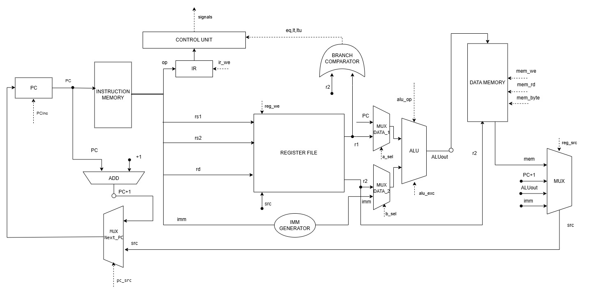
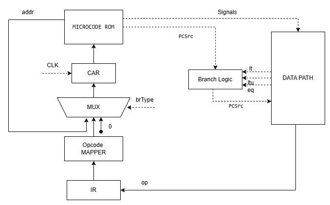

# Лабораторная работа №4. Эксперимент

- ФИО: **Кантунья Жан Карло**
- Группа: **P3220**
- Вариант:

```text
alg | risc | harv | mc | tick | binary | stream | mem | pstr | alg1
```

## Table of Contents

- [Язык программирования](#язык-программирования)
- [Организация памяти](#организация-памяти)
- [Система команд](#система-команд)
- [Транслятор](#транслятор)
- [Модель процессора](#модель-процессора)
- [Тестирование](#тестирование)
- [Пример использования инструментальной цепочки](#пример-использования-инструментальной-цепочки)

---

## Язык программирования

### Общая характеристика

В проекте реализован JavaScript-подобный язык. 
Программа состоит из функций, каждая функция — из последовательности операторов, 
разделённых точкой с запятой. Поддерживаются объявления переменных, присваивания, 
условные операторы, циклы, вызовы встроенных функций, массивы, строки в формате pstr.

Язык поддерживает:

- объявления переменных `let` (с возможной инициализацией);
- присваивания;
- составной оператор (`block`);
- условный оператор `if` / `else`;
- циклы `while`;
- определения функций `function` (с поддержкой до 8 параметров, передаваемых через `a0`..`a7`);
- оператор `halt;` для остановки модели;
- встроенные функции `print(int)` (выводит младший байт как символ), `print_str(int[])`, `print_num(int)` (печатает десятичное представление числа), `read()`;
- литералы: целые числа, шестнадцатеричные числа, символы, строки, `true`, `false`;
- арифметические, побитовые, логические и операторы сравнения с обычным приоритетом C;
- `&&` и `||` реализуются через short-circuit семантику.

Транслятор (`src/hl_logic.py`) реализует подмножество грамматики, достаточное для написания учебных программ, и компилирует исходник в текстовое ассемблерное представление, которое затем ассемблируется в бинарный образ.

### Синтаксис (BNF)

```bnf
<program>      ::= <function>*

<function>     ::= "function" <identifier> "(" <param-list>? ")" <block>

<param-list>   ::= <identifier> ("," <identifier>)*

<block>        ::= "{" <statement>* "}"

<statement>    ::= <var-decl> ";"
                 | <assignment> ";"
                 | <if-stmt>
                 | <while-stmt>
                 | <return-stmt> ";"
                 | <call-stmt> ";"
                 | <block>
                 | "halt" ";"
                 | ";"

<var-decl>     ::= "let" <identifier> ("[" <expr> "]")? ("=" <expr>)?

<assignment>   ::= <identifier> ("[" <expr> "]")* "=" <expr>

<if-stmt>      ::= "if" "(" <expr> ")" <statement> ("else" <statement>)?

<while-stmt>   ::= "while" "(" <expr> ")" <statement>

<return-stmt>  ::= "return" <expr>?

<call-stmt>    ::= <identifier> "(" <arg-list>? ")"
                 | "print" "(" <expr> ")"
                 | "print_num" "(" <expr> ")"
                 | "print_str" "(" <expr> ")"
                 | "read" "(" ")"

<expr>         ::= <literal>
                 | <identifier>
                 | <unary-op> <expr>
                 | <expr> <binary-op> <expr>
                 | <identifier> "(" <arg-list>? ")"
                 | "len" "(" <expr> ")"
                 | <identifier> ("[" <expr> "]")+
                 | "{" <arg-list>? "}"
                 | "(" <expr> ")"

<literal>      ::= <int-literal> | <string-literal> | "true" | "false"

<int-literal>  ::= <number> | <hex-number> | <char-literal>

<number>       ::= [0-9]+

<hex-number>   ::= "0x" [0-9a-fA-F]+

<char-literal> ::= "'" <ascii-char> "'"

<string-literal> ::= '"' <ascii-char>* '"'

<ascii-char>   ::= <any printable ASCII character> | "\n" | "\t" | "\r" | "\\" | "\'"

<arg-list>     ::= <expr> ("," <expr>)*

<unary-op>     ::= "-" | "~" | "!"

<binary-op>    ::= "+" | "-" | "*" | "/" | "%"
                 | "<<" | ">>"
                 | "&" | "|" | "^"
                 | "==" | "!=" | "<" | ">" | "<=" | ">="
                 | "&&" | "||"

<identifier>   ::= [a-zA-Z_][a-zA-Z0-9_]*

<comment>      ::= "//" <any-char>* <newline>
```

### Семантика

#### Стратегия вычислений

- используется **eager evaluation**: аргументы выражений вычисляются до применения операции;
- `if` вычисляет только выбранную ветвь;
- `&&` и `||` имеют short-circuit семантику: правый операнд не вычисляется, если результат уже определён;
- `while` повторно вычисляет условие и выполняет тело, пока условие истинно;
- `function` вводит новую область видимости;
- `halt;` останавливает модель процессора;
- `len(arr)` — возвращает количество элементов массива (известно на этапе компиляции, используется как `len(arr)`).

#### Области видимости

- глобальных переменных нет — все переменные объявляются внутри функций;
- переменные, объявленные через `let`, видны только внутри блока, в котором они объявлены, и во вложенных блоках (тело функции — тоже блок);
- имя переменной должно быть объявлено до первого использования;
- параметры функций: до 8 параметров, передаются через `a0`..`a7`.

#### Типизация

Язык использует статическую строгую типизацию. Поддерживаются два основных представления данных: 
целые числа `int` и статические массивы `int[]`. Строки не являются отдельным типом и хранятся 
как массивы `int[]` в формате `pstr`.

#### Виды литералов

| Литерал          | Тип значения | Пример          |
|------------------|--------------|------------------|
| численный        | `int`        | знаковое 32-бит целое от -2147483648 до 2147483647 |
| символьный       | `int`        | `'A'`, `'\n'`, `'\t'` (одиночный ASCII с поддержкой спец-символов) |
| строковый        | `int[]`      | `"Hello, world!"` — набор символьных литералов в кавычках, подчиняющийся правилам символьных |
| логические       | `int`        | `true` (1), `false` (0) |
| массив           | `int[]`      | `{1, 2, 3}` — фигурные скобки, элементы через запятую |


#### Массивы

Язык поддерживает статические одномерные массивы `int[]`. Массивы размещаются в `gp`-относительной памяти данных. Доступ к элементам осуществляется через индексацию в квадратных скобках.

**Объявление массивов:**

```javascript
// Массив с инициализацией из литерала (размер определяется количеством элементов)
let arr = {10, 20, 30, 40, 50};

// Массив с указанием размера (все элементы обнуляются)
let buf[256];

// Массив с указанием размера и частичной инициализацией
let data[10] = {1, 2, 3};
```

**Доступ к элементам:**

```javascript
let x = arr[0];       // чтение элемента
arr[1] = 99;          // запись элемента
let i = 2;
let y = arr[i];       // индекс может быть переменной
arr[i + 1] = 42;      // индекс может быть выражением
```

#### Пример программы

```javascript
// Печатает числа от 0 до 9, затем перевод строки
function main() {
    let i = 0;
    while (i < 10) {
        print(i + 48);
        i = i + 1;
    }
    print(10);
    halt;
}
```

Транслятор генерирует следующий ассемблер (см. `examples/count.asm`):

```asm
    .data 0
data_start:
    .word 0  ; i
    .text 0
    J main
    main:
    ADDI gp, zero, data_start
    SW zero, gp, 0
    wc_1:
    LW t0, gp, 0
    ADDI t1, zero, 10
    BGE t0, t1, en_2
    LUI t2, 0
    ADDI t2, t2, -12
    LW t3, gp, 0
    ADDI t4, t3, 48
    SW t4, t2, 0
    LW t5, gp, 0
    ADDI t6, t5, 1
    SW t6, gp, 0
    J wc_1
    en_2:
    LUI t0, 0
    ADDI t0, t0, -12
    ADDI t1, zero, 10
    SW t1, t0, 0
    HALT
```

Псевдоинструкция `MV rd, rs` транслируется ассемблером в `ADD rd, rs, zero` (R-format).

#### Примеры других программ

- `examples/hello.alg` — печатает `Hello, World!` через `print_str`;
- `examples/sum.alg` — складывает два числа и печатает ASCII-цифру;
- `examples/alg1_optimized.alg`, `examples/alg1_bruteforce.alg` — два варианта Project Euler №4 (наибольшее число-палиндром).

---

## Организация памяти

### Общая модель

Используется **гарвардская архитектура**: память инструкций и память данных физически разделены. Машинное слово — 32 бита. Память данных — байт-адресуемая, память инструкций — слов-адресуемая (word-addressable, доступ через `instruction_memory[PC >> 2]`).

Параметры памяти:

- машинное слово: 32 бита;
- инструкция: 32 бита фиксированной длины;
- память данных: байтовая адресация, выравнивание 4 байта;
- размер памяти данных: 32768 байт (32 KiB, см. `DATA_MEM_SIZE` в `src/isa.py`);
- база стека: `0x8000` (`STACK_BASE`), стек растёт вниз; вся память данных (32 KiB) доступна как для статических данных, так и для стека (стек растёт от `STACK_BASE` вниз, данные — от `0x0000` вверх);
- память инструкций: word-addressable, адресация: `instruction_memory[PC >> 2]`, PC — байтовый адрес;
- ввод-вывод реализован через memory-mapped I/O

### Регистры

#### Скалярные регистры (32 × 32 бита)

| Алиас   | Номер | Назначение                  |
|---------|------:|------------------------------|
| `zero`  | 0     | всегда 0                    |
| `ra`    | 1     | адрес возврата              |
| `sp`    | 2     | указатель стека             |
| `gp`    | 3     | глобальный указатель        |
| `a0..a7`| 4..11 | аргументы / возврат значения|
| `t0..t5`| 12..17| временные                   |
| `s0..s11`|18..29| дополнительные временные (не используются для хранения переменных)|
| `t6`    | 30    | временный                   |
| `tp`    | 31    | резерв                      |

### Разбиение адресного пространства

#### Instruction memory

```text
0x0000  +------------------------+
        | program start          |
        |   .org 0               |
        |   J main               |
        |   main: ...            |
        |   user functions       |
        |   generated helpers    |
        |   ...                  |
        +------------------------+
```

Инструкции располагаются в порядке эмиссии; PC увеличивается на `+4` за инструкцию (выборка: `instruction_memory[PC >> 2]`).

#### Data memory

```text
0x00000000  +------------------------+
            | литералы, статические  |
            | данные программы       |
            | (.word)                |
            |                        |
            |  gp-относительная      |
            |  (data_start)          |
            |                        |
0x00008000  +------------------------+
            | stack (растёт вниз)    |
            |   ...                  |
            |   saved ra, locals     |
0xFFFFFFF0  +------------------------+
            | IN_PORT  (read-only)   |
0xFFFFFFF4  +------------------------+
            | OUT_PORT (write-only)  |
            +------------------------+
```
 
#### Memory-mapped I/O
 
| Адрес        | Имя       | Доступ     | Назначение                              |
|--------------|-----------|------------|------------------------------------------|
| `0xFFFFFFF0` | `IN_PORT` | read-only  | MMIO: читает следующий байт из входного потока |
| `0xFFFFFFF4` | `OUT_PORT`| write-only | MMIO: пишет младший байт в выходной поток      |

Эти адреса являются memory-mapped I/O и не принадлежат обычной памяти данных. Запись в `IN_PORT` или чтение из `OUT_PORT` в модели не приводит к ошибке, но и не имеет наблюдаемого эффекта. В ассемблере адреса `IN_PORT`/`OUT_PORT` кодируются через `LW`/`LB` с 12-битным immediate: `0xFFF0` = −16, `0xFFF4` = −12. Знаковое расширение до 32 бит даёт полный адрес `0xFFFFFFF0` / `0xFFFFFFF4`.

### Формат строк `pstr`

Строка хранится как последовательность 32-битных слов:

```text
    word 0 : length
    word 1 : char[0]
    word 2 : char[1]
    ...
```

Каждый символ занимает одно машинное слово; `length` хранит количество символов.
Компилятор HL эмитирует строку через директиву `.string`, которая ассемблером разворачивается в pstr (слово длины + слова символов).
Например строка `"Hi"` компилируется в:
```asm
    .string "Hi"
```
Что ассемблер транслирует в:
```asm
    .word 2      ; len "Hi"
    .word 72     ; 'H'
    .word 105    ; 'i'
```

### Механика отображения объектов языка на память

**Литералы.** Малый целый/шестнадцатеричный литерал (`-2048..2047`) кодируется как 12-битный immediate в `ADDI`; литерал вне этого диапазона разворачивается в `LUI` + `ADDI`. Символьный литерал `'<c>'` — это `int` со значением `ord(c)`. Логические `true`/`false` — `1` / `0`. Строковый литерал в `print_str` сохраняется в `.data` как `pstr` (`length` + слова символов, ровно `1 + len` слов) и выделяется последовательно в порядке первого использования.

**Константы.** В текущей реализации HL отдельных `const`-объявлений нет — их роль исполняют литералы. В `.asm` они могут быть объявлены через `.word` в любой секции.

**Переменные.** Все скалярные переменные отображаются в `gp`-относительную память данных (`SW rs2, gp, off` / `LW rd, gp, off`), распределение — в `src/hl_logic.py` (`vl()`). Регистры `s0..s11` не используются для хранения переменных. Поддержка стека с локальными переменными (`sp`-относительно) предусмотрена архитектурой, но в текущей реализации HL не используется.

**Инструкции.** Кодируются ассемблером в 32-битные слова и располагаются в `.text` начиная с адреса 4 (после `J main` по адресу 0, PC инкрементируется на 4). Метки разрешаются за два прохода: `ADDI` с известным immediate — одна строка, переходы по меткам — после второго прохода.

**Процедуры.** Поддерживаются пользовательские функции с `JAL`/`JR`: пролог сохраняет только `ra` на стеке (регистры `s0..s11` не используются для переменных, поэтому их сохранение не требуется), эпилог восстанавливает `ra` и возвращается по `JR ra`. Runtime-процедуры (`print_str`, цикл печати) компилируются inline. Если `main` не заканчивается `halt`, компилятор добавляет его автоматически.

**Прерывания .** Прерываний и trap-механизма нет. Ввод-вывод синхронный: `IN_PORT` возвращает следующий байт из входного буфера модели (или `0`, если буфер пуст); `OUT_PORT` дописывает байт в выходной буфер.

#### Регистровое отображение выражений

Вычисление выражений использует **7 временных регистров** `t0..t6` (константа `TREGS` в `hl_logic.py`), выделяемых в циклическом порядке. Функция `ar()` (`hl_logic.py`) возвращает `t[nr % 7]` и инкрементирует счётчик `nr`. Регистры не сохраняются и не восстанавливаются между вызовами `ar()` — повторное использование возможно, когда предыдущий результат уже не нужен (глубина вложенности выражений ограничена 7 регистрами).

**Типы значений, переносимых в регистрах:**

| Тип | Представление | Пример генерации |
|-----|--------------|-------------------|
| `int` (константа) | `ADDI rd, zero, val` или `LUI`+`ADDI` | `ADDI t0, zero, 42` |
| `int` (переменная) | `LW rd, gp, offset` | `LW t0, gp, 0` (из `vl()`) |
| `arr` | кортеж `("arr", offset, len)` | не материализуется в регистр |
| сравнение | кортеж `(op, lreg, rreg)` | `("==", "t0", "t1")` — отложенная генерация в `er()` |

**Последовательность материализации (`ge()` → `er()`):**

1. `ge(e)` рекурсивно обходит AST выражения, вызывает `ar()` для временных регистров, испускает код
2. Если левый и правый операнды — целые константы, `_eb()` вычисляет результат на этапе компиляции (constant folding)
3. Сравнения (`<`, `>`, `==`, etc.) возвращают кортеж `(op, lreg, rreg)` без немедленной эмиссии — реальный `SLT`/`XORI` генерируется при вызове `er()`, когда результат нужно записать в регистр (или в `BEQ`/`BNE` для короткого замыкания)
4. Short-circuit `&&`/`||` генерирует `MV` + условный переход, пропускающий вычисление правого операнда

**Пример:** выражение `a + b * 3` для `a` (смещение 0) и `b` (смещение 4) компилируется в:

```asm
LW  t0, gp, 4     ; b → t0
ADDI t1, t0, 3     ; b*3 → t1 (а не MUL, т.к. right — immediate в I12)
LW  t0, gp, 0     ; a → t0 (t0 переиспользован: b уже не нужен)
ADD t2, t0, t1    ; a + b*3 → t2
```

---

## Система команд

### Особенности процессора

- **RISC** ISA (load/store): арифметика работает только над регистрами, память доступна только через `LW`/`LB`/`SW`/`SB`/`LUI`.
- **Harvard**: инструкции и данные в разных адресных пространствах.
- **Фиксированная длина** инструкции: 32 бита.
- **Микрокодированная** CU: горизонтальная µROM.
- **Tick-accurate**: каждый вызов `tick()` моделирует ровно одну микроинструкцию.
- **Двоичное** представление: выход ассемблера — поток 32-битных little-endian слов.
- **Stream I/O**: ввод/вывод через байтовые потоки модели (stdin/stdout).
- **Memory-mapped I/O**: `IN_PORT`/`OUT_PORT` по фиксированным адресам `0xFFFFFFF0`/`0xFFFFFFF4`.
- **Pascal strings**: строки хранятся как `pstr` (length + chars) в памяти данных.

### Форматы инструкций

Все инструкции имеют длину 32 бита.

| Формат | Назначение                                                  |
|--------|--------------------------------------------------------------|
| R      | регистр-регистр арифметика                                  |
| I      | immediate, `LW`/`LB`                                        |
| S      | `SW`/`SB`                                                     |
| B      | условные переходы                                            |
| U      | `LUI` (загрузка верхней части immediate)                    |
| J      | `J` (безусловный переход)                                   |
| JL     | `JAL` (переход с сохранением PC+4 в регистр)               |
| JR     | `JR` (косвенный переход через регистр)                      |
| —      | `HALT` (опкод без операндов)                                |

#### R-type

```text
    31      26 25    21 20    16 15    11 10         0
   +--------+--------+--------+--------+-----------+
   | opcode |   rd   |  rs1   |  rs2   |     0     |
   +--------+--------+--------+--------+-----------+
   |  6 бит |  5 бит |  5 бит |  5 бит |   11 бит  |
```

Используют: `ADD`, `SUB`, `MUL`, `DIV`, `REM`, `MULH`, `AND`, `OR`, `XOR`, `NOT`, `SLL`, `SRL`, `SRA`, `SLT`, `NOP`.

#### I-type

```text
    31      26 25    21 20    16 15    12 11         0
   +--------+--------+--------+--------+-----------+
   | opcode |   rd   |  rs1   |   0    |    imm    |
   +--------+--------+--------+--------+-----------+
   |  6 бит |  5 бит |  5 бит | 4 бита |   12 бит  |
```

Используют: `ADDI`, `ANDI`, `ORI`, `XORI`, `SLLI`, `SRLI`, `SRAI`, `SLTI`, `LW`, `LB`.

#### S-type

```text
    31      26 25    21 20    16 15    11 10         0
   +--------+--------+--------+--------+-----------+
   | opcode |   0    |  rs1   |  rs2   |    imm    |
   +--------+--------+--------+--------+-----------+
   |  6 бит |  5 бит |  5 бит |  5 бит |   11 бит  |
```

Используют: `SW`, `SB`.

#### B-type

```text
    31      26 25    21 20    16 15    11 10         0
   +--------+--------+--------+--------+-----------+
   | opcode |   0    |  rs1   |  rs2   |  offset   |
   +--------+--------+--------+--------+-----------+
   |  6 бит |  5 бит |  5 бит |  5 бит |   11 бит  |
```

Используют: `BEQ`, `BNE`, `BLT`, `BLE`, `BGT`, `BGE`, `BGTU`, `BLEU`.

Offset — знаковое 11-битное смещение в байтах: диапазон `-1024..+1023` от PC. Адрес перехода обязан быть выровнен на 4 байта.

#### U-type

```text
    31      26 25    21 20                             0
   +--------+--------+-------------------------------+
   | opcode |   rd   |       imm (20 бит)            |
   +--------+--------+-------------------------------+
   |  6 бит |  5 бит |           20 бит              |
```

Использует: `LUI` (`rd = imm << 12` — immediate 20 бит, сдвиг на 12, диапазон `0..1 048 575`). Сдвиг на 12 бит объясняется тем, что I-type использует 12-битный immediate: LUI загружает старшие 20 бит, которые при комбинации с ADDI образуют полный 32-битный адрес.

#### J / JL / JR

```text
   J:  [ opcode (6) |          target (26)             ]
   JL: [ opcode (6) | rd (5)  |     target (21)        ]
   JR: [ opcode (6) |  0 (5)  | rm (5) |      0        ]
```

### Набор инструкций

#### Загрузка констант и доступ к памяти

| Инструкция | Формат | Опкод | Синтаксис                   | Операция                              |
|-----------|--------|-------|------------------------------|----------------------------------------|
| `LW`      | I      | 0x01  | `LW rd, rs1, offset`        | `rd = MEM[rs1 + sign_ext(offset)]`    |
| `SW`      | S      | 0x02  | `SW rs2, rs1, offset`       | `MEM[rs1 + sign_ext(offset)] = rs2`   |
| `LB`      | I      | 0x03  | `LB rd, rs1, offset`        | `rd = sign_ext(MEM[rs1+offset][7:0])` |
| `SB`      | S      | 0x04  | `SB rs2, rs1, offset`       | `MEM[rs1+offset][7:0] = rs2[7:0]`     |
| `LUI`     | U      | 0x05  | `LUI rd, imm`               | `rd = imm << 12`                       |

#### Арифметика

| Инструкция | Формат | Опкод | Синтаксис            | Операция                       |
|-----------|--------|-------|----------------------|---------------------------------|
| `ADD`     | R      | 0x06  | `ADD rd, rs1, rs2`  | `rd = rs1 + rs2`                |
| `SUB`     | R      | 0x07  | `SUB rd, rs1, rs2`  | `rd = rs1 - rs2`                |
| `MUL`     | R      | 0x08  | `MUL rd, rs1, rs2`  | `rd = (rs1 * rs2)[31:0]`        |
| `DIV`     | R      | 0x09  | `DIV rd, rs1, rs2`  | `rd = rs1 / rs2` (знаковое)       |
| `REM`     | R      | 0x0A  | `REM rd, rs1, rs2`  | `rd = rs1 % rs2` (знаковое)       |
| `MULH`    | R      | 0x0B  | `MULH rd, rs1, rs2` | `rd = (rs1 * rs2)[63:32]`       |
| `ADDI`    | I      | 0x14  | `ADDI rd, rs1, imm` | `rd = rs1 + sign_ext(imm)`      |

#### Побитовые

| Инструкция | Формат | Опкод | Синтаксис            | Операция           |
|-----------|--------|-------|----------------------|---------------------|
| `AND`     | R      | 0x0C  | `AND rd, rs1, rs2`  | `rd = rs1 & rs2`   |
| `OR`      | R      | 0x0D  | `OR rd, rs1, rs2`   | `rd = rs1 \| rs2`   |
| `XOR`     | R      | 0x0E  | `XOR rd, rs1, rs2`  | `rd = rs1 ^ rs2`   |
| `NOT`     | R      | 0x0F  | `NOT rd, rs1`       | `rd = ~rs1` (rs2 игнорируется) |
| `ANDI`    | I      | 0x15  | `ANDI rd, rs1, imm` | `rd = rs1 & sign_ext(imm)` |
| `ORI`     | I      | 0x16  | `ORI rd, rs1, imm`  | `rd = rs1 \| sign_ext(imm)` |
| `XORI`    | I      | 0x17  | `XORI rd, rs1, imm` | `rd = rs1 ^ sign_ext(imm)` |

#### Сдвиги

| Инструкция | Формат | Опкод | Синтаксис              | Операция                        |
|-----------|--------|-------|------------------------|----------------------------------|
| `SLL`     | R      | 0x10  | `SLL rd, rs1, rs2`    | `rd = rs1 << (rs2 & 0x1F)`     |
| `SRL`     | R      | 0x11  | `SRL rd, rs1, rs2`    | `rd = rs1 >> (rs2 & 0x1F)` (логич.) |
| `SRA`     | R      | 0x12  | `SRA rd, rs1, rs2`    | `rd = rs1 >> (rs2 & 0x1F)` (арифм.) |
| `SLLI`    | I      | 0x18  | `SLLI rd, rs1, imm`   | `rd = rs1 << (imm & 0x1F)`     |
| `SRLI`    | I      | 0x19  | `SRLI rd, rs1, imm`   | `rd = rs1 >> (imm & 0x1F)` (логич.) |
| `SRAI`    | I      | 0x1A  | `SRAI rd, rs1, imm`   | `rd = rs1 >> (imm & 0x1F)` (арифм.) |

#### Сравнения

| Инструкция | Формат | Опкод | Синтаксис            | Операция                                |
|-----------|--------|-------|----------------------|------------------------------------------|
| `SLT`     | R      | 0x13  | `SLT rd, rs1, rs2`  | `rd = 1` если `rs1 < rs2` (знаковое)      |
| `SLTI`    | I      | 0x1B  | `SLTI rd, rs1, imm` | `rd = 1` если `rs1 < sign_ext(imm)` (знаковое) |

#### Условные переходы

| Инструкция | Формат | Опкод | Синтаксис                | Операция                                |
|-----------|--------|-------|--------------------------|------------------------------------------|
| `BEQ`     | B      | 0x20  | `BEQ rs1, rs2, label`   | `if rs1 == rs2: PC += sign_ext(offset)` (PC уже после FETCH)            |
| `BNE`     | B      | 0x21  | `BNE rs1, rs2, label`   | `if rs1 != rs2: PC += sign_ext(offset)` (PC уже после FETCH)            |
| `BLT`     | B      | 0x22  | `BLT rs1, rs2, label`   | `if rs1 < rs2: PC += sign_ext(offset)` (знаковое, PC уже после FETCH)     |
| `BLE`     | B      | 0x23  | `BLE rs1, rs2, label`   | `if rs1 <= rs2: PC += sign_ext(offset)` (знаковое, PC уже после FETCH)    |
| `BGT`     | B      | 0x24  | `BGT rs1, rs2, label`   | `if rs1 > rs2: PC += sign_ext(offset)` (знаковое, PC уже после FETCH)     |
| `BGE`     | B      | 0x25  | `BGE rs1, rs2, label`   | `if rs1 >= rs2: PC += sign_ext(offset)` (знаковое, PC уже после FETCH)    |
| `BGTU`    | B      | 0x26  | `BGTU rs1, rs2, label`  | беззнаковое `>` (PC уже после FETCH)                                    |
| `BLEU`    | B      | 0x27  | `BLEU rs1, rs2, label`  | беззнаковое `<=` (PC уже после FETCH)                                   |

Смещение branch: signed 11 бит, диапазон `-1024..+1023` байт.

#### Безусловные переходы

| Инструкция | Формат | Опкод | Синтаксис            | Операция                                |
|-----------|--------|-------|----------------------|------------------------------------------|
| `J`       | J      | 0x28  | `J label`            | `PC = PC + sign_ext(imm26)` (PC-relative)   |
| `JAL`     | JL     | 0x29  | `JAL rd, label`      | `rd = PC + 4; PC = PC + sign_ext(imm21)`    |
| `JR`      | JR     | 0x2A  | `JR rm`              | `PC = rm`                                    |

#### Управление

| Инструкция | Формат | Опкод | Операция                       |
|-----------|--------|-------|---------------------------------|
| `NOP`     | R      | 0x00  | нет операции (кодируется как `ADD zero, zero, zero`) |
| `HALT`    | —      | 0x3F  | остановка модели                |

### Количество тактов

| Инструкция / фаза | Такты | Микропрограмма |
|---|---:|---|
| `R` (ADD/SUB/MUL/DIV/REM/MULH, AND/OR/XOR/NOT/SLL/SRL/SRA/SLT) | 3 | FETCH → DECODE → R_EX |
| `I` (ADDI/ANDI/ORI/XORI, SLLI/SRLI/SRAI/SLTI) | 3 | FETCH → DECODE → I_EX |
| `LUI` | 3 | FETCH → DECODE → U_EX |
| `LW` / `LB` | 4 | FETCH → DECODE → L_EXEC → L_WB |
| `SW` / `SB` | 3 | FETCH → DECODE → S_EXEC |
| `BEQ`/`BNE`/`BLT`/`BLE`, `BGT`/`BGE`/`BGTU`/`BLEU` | 3 | FETCH → DECODE → B_EX |
| `J` | 3 | FETCH → DECODE → J_EX |
| `JAL` | 4 | FETCH → DECODE → JL_EXEC → JL_WB |
| `JR` | 3 | FETCH → DECODE → JR_EX |
| `NOP` | 3 | FETCH → DECODE → NOP |
| `HALT` | 3 | FETCH → DECODE → HALT |


---

## Транслятор

Транслятор реализован как консольное приложение, обеспечивающее полный цикл преобразования исходного кода в исполняемый бинарный образ.

### Принципы работы

Транслятор работает в два этапа:

1. **Компиляция (HL Compiler - `src/hl_logic.py`)**:
   - **Lexer**: Разбиение исходного кода (`.alg`) на токены.
   - **Parser**: Построение абстрактного синтаксического дерева (AST).
   - **CodeGen**: Обход AST и генерация ассемблерного кода (`.asm`) с использованием пред-аллоцированных регистров.

2. **Ассемблирование (Assembler - `src/translator.py`)**:
   - Принимает ассемблерный код (`.asm`) и преобразует его в машинный код (`.bin`).
   - Разрешает метки переходов за два прохода (First pass: вычисление адресов, Second pass: кодирование инструкций).
   - Поддерживает псевдоинструкции: `MV rd, rs` (`ADD rd, rs, zero`), `LI rd, val` (загрузка 32-битной константы), `JMP label` (`J label`), `BEQZ`/`BNEZ`/`BGTZ`/`BLTZ`.
   - Генерирует файл `.lst` для отладки.

### Интерфейс командной строки

Для взаимодействия используется `src/cli.py`.

#### Команда `compile` (полная трансляция)

```bash
python -m src.cli compile <input.alg> <output.bin>
```

- **Входные данные:**
  - `<input.alg>`: имя файла с исходным кодом.
- **Выходные данные:**
  - `<output.bin>`: итоговый бинарный файл.

#### Команда `asm` (только ассемблирование)

```bash
python -m src.cli asm <input.asm> <output.bin>
```

- **Входные данные:**
  - `<input.asm>`: имя файла с ассемблерным кодом.
- **Выходные данные:**
  - `<output.bin>`: итоговый бинарный файл.

## Модель процессора

### Общая структура

Архитектура **не является конвейерной** — процессор выполняет микропрограмму строго последовательно. В каждый такт выполняется ровно одна микроинструкция. Переходы между микроинструкциями осуществляются посредством мультиплексора `uPC` (Micro Program Counter), управляемого полем `br_type`.

Модель состоит из:

- **DataPath** (`src/data_path.py`): register file, ALU, branch comparator, data memory, program counter, instruction register, ALU_OUT, feedback bus;
- **ControlPath** (`src/control_path.py`): горизонтальная µROM (45 микроинструкций), MAPPER-таблица, мультиплексор `uPC`, логика ветвлений;
- **DataMemory** (`src/data_path.py`): байт-адресуемая память данных 32 KiB, с перехватами `IN_PORT`/`OUT_PORT`;
- **InstructionMemory**: массив слов, адресуется `PC >> 2`;
- **Машина** (`src/machine.py`): объединяет DP+CP, ведёт журнал тактов, ограничивает `max_ticks`.

### DataPath

`DataPath` содержит:

- `PC`, `IR`;
- `RegisterFile` (32 × 32 бит, читается по `rs1`/`rs2`, пишется по `rd` через `reg_we` + `reg_src`);
- `ALU`: `ADD`/`SUB`/`MUL`/`MULH`/`DIV`/`REM`/`AND`/`OR`/`XOR`/`NOT`/`SLL`/`SRL`/`SRA`/`SLT`;
- `BranchComparator`: возвращает `eq`, `lt`, `ltu` для `rs1`/`rs2` (используется в `ControlPath.evaluate_branch()`);
- `ALU_OUT`, `src_bus`;
- `DataMemory`: байты, отображение `IN_PORT`/`OUT_PORT` на input/output stream.

Основные мультиплексоры:

- `MUX_A`: `0=none`, `1=rs1`, `2=PC`;
- `MUX_B`: `0=none`, `1=rs2`, `2=imm`, `3=zero`, `4=imm_u26`, `5=imm_u21`;
- `MUX_WB`: `0=none`, `1=ALU_OUT`, `2=MEM`, `3=PC+4`, `4=imm<<12`, `5=imm_u26`, `6=imm_u21`;
- `MUX_PC`: `PC+4` либо `src_bus`.



### ControlUnit

`ControlUnit` — горизонтально-микрокодированный. µROM (`src/control_unit.py`) содержит 45 микроинструкций (адреса 0–44). На каждом такте выбирается микроинструкция по текущему адресу `uPC`; после её исполнения значение `uPC` обновляется в соответствии с полем `br_type`:

| `br_type` | Следующий `uPC`                                  |
|-----------|---------------------------------------------------|
| `1`       | `uPC = mi.addr` (явный переход)                   |
| `2`       | `uPC = _MAP[opcode]` (диспетчеризация по опкоду)   |
| `3`       | `uPC = 0` (возврат в `FETCH`)                    |


Перечень микроинструкций в µROM (45 элементов, индексы 0–44):

| Индекс | Имя       | Назначение                          |
|--------|-----------|--------------------------------------|
| 0      | FETCH     | выборка инструкции (IR), PC += 4   |
| 1      | DECODE    | uPC = MAP[opcode]                   |
| 2      | NOP       | холостой такт                       |
| 3      | LW_EXEC   | вычисление адреса, mem_rd           |
| 4      | LW_WB     | writeback из памяти в rd            |
| 5      | SW_EXEC   | вычисление адреса, mem_wr           |
| 6      | LB_EXEC   | вычисление адреса, mem_rd (byte)    |
| 7      | LB_WB     | writeback из памяти в rd            |
| 8      | SB_EXEC   | вычисление адреса, mem_wr (byte)    |
| 9      | LUI       | writeback imm<<12 в rd              |
| 10     | ADD       | R-type: ALU op + writeback          |
| 11     | SUB       | R-type: ALU op + writeback          |
| 12     | MUL       | R-type: ALU op + writeback          |
| 13     | DIV       | R-type: ALU op + writeback          |
| 14     | REM       | R-type: ALU op + writeback          |
| 15     | MULH      | R-type: ALU op + writeback          |
| 16     | AND       | R-type: ALU op + writeback          |
| 17     | OR        | R-type: ALU op + writeback          |
| 18     | XOR       | R-type: ALU op + writeback          |
| 19     | NOT       | R-type: ALU op + writeback          |
| 20     | SLL       | R-type: ALU op + writeback          |
| 21     | SRL       | R-type: ALU op + writeback          |
| 22     | SRA       | R-type: ALU op + writeback          |
| 23     | SLT       | R-type: ALU op + writeback          |
| 24     | ADDI      | I-type: ALU op + writeback          |
| 25     | ANDI      | I-type: ALU op + writeback          |
| 26     | ORI       | I-type: ALU op + writeback          |
| 27     | XORI      | I-type: ALU op + writeback          |
| 28     | SLLI      | I-type: ALU op + writeback          |
| 29     | SRLI      | I-type: ALU op + writeback          |
| 30     | SRAI      | I-type: ALU op + writeback          |
| 31     | SLTI      | I-type: ALU op + writeback          |
| 32     | BEQ       | branch: PC += imm (если условие)    |
| 33     | BNE       | branch: PC += imm (если условие)    |
| 34     | BLT       | branch: PC += imm (если условие)    |
| 35     | BLE       | branch: PC += imm (если условие)    |
| 36     | BGT       | branch: PC += imm (если условие)    |
| 37     | BGE       | branch: PC += imm (если условие)    |
| 38     | BGTU      | branch: PC += imm (если условие)    |
| 39     | BLEU      | branch: PC += imm (если условие)    |
| 40     | J         | jump: PC = PC + sign_ext(imm26)     |
| 41     | JAL_EXEC  | save PC+4 → rd                      |
| 42     | JAL_WB    | jump: PC = PC + sign_ext(imm21)     |
| 43     | JR        | jump: PC = rm                       |
| 44     | HALT      | остановка модели                    |

Каждая микроинструкция (включая `FETCH`, `DECODE` и все остальные) занимает 1 такт.



### Микрокодирование

#### Микроинструкция (MI)

Каждая микроинструкция кодируется как 30-битное слово `MIR`:

| Бит(ы)  | Поле       | Назначение                                                      |
|---------|------------|-----------------------------------------------------------------|
| 0       | `ir_we`    | разрешение записи в `IR` (строб выборки инструкции)            |
| 1       | `alu_exec` | строб ALU                                                       |
| 2       | `pc_src`   | `1` = загрузить `PC` из `feedback_bus` (переход)               |
| 5–6     | `a_sel`    | выбор операнда A для ALU: `0=none`, `1=rs1`, `2=PC`            |
| 7–9     | `b_sel`    | выбор операнда B для ALU: `0=none`, `1=rs2`, `2=imm`, `3=zero`, `4=imm_u26`, `5=imm_u21` |
| 10      | `mar_we`   | разрешение записи в `MAR`                                       |
| 11      | `mem_rd`   | строб чтения из памяти                                          |
| 12      | `mem_wr`   | строб записи в память                                           |
| 13      | `mem_byte` | байтовый режим (`LB`/`SB`)                                      |
| 14      | `reg_we`   | разрешение записи в регистровый файл                            |
| 15–17   | `reg_src`  | источник `feedback_bus`: `0=none`, `1=ALU_OUT`, `2=MEM`, `3=PC+4`, `4=imm<<12`, `5=imm_u26`, `6=imm_u21` |
| 19      | `halt`     | запрос остановки                                                |
| 20–21   | `br_type`  | управление `uPC`: `0=next`, `1=addr`, `2=MAPPER`, `3=FETCH`    |
| 22–29   | `addr`     | явный адрес перехода (для `br_type=1`)                          |

### Фазы выполнения инструкций

Каждая инструкция проходит через набор фаз, определяемых микропрограммой в µROM.

#### Последовательности микроинструкций

| Инструкция          | µROM-последовательность                                             |
|---------------------|----------------------------------------------------------------------|
| `ADD`/`SUB`/...     | `FETCH → DECODE → ADD/SUB/...`                              |
| `ADDI`/`LUI`/...    | `FETCH → DECODE → ADDI/...`                                 |
| `LW`/`LB`           | `FETCH → DECODE → L_EXEC → L_WB`                             |
| `SW`/`SB`           | `FETCH → DECODE → S_EXEC`                                    |
| `BEQ`/`BNE`/...     | `FETCH → DECODE → B_EX`                                      |
| `J`                 | `FETCH → DECODE → J_EX`                                      |
| `JAL`               | `FETCH → DECODE → JL_EXEC → JL_WB`                           |
| `JR`                | `FETCH → DECODE → JR_EX`                                     |
| `NOP`               | `FETCH → DECODE → NOP`                                       |
| `HALT`              | `FETCH → DECODE → HALT`                                      |


### Точность моделирования

`tick` выполняет ровно одну микроинструкцию: читает текущую `MI` через `current_mi`, передаёт её в `DataPath`, делает snapshot, затем вызывает `advance` для обновления `uPC`.

Журнал (`get_journal`) для каждого такта содержит:

- номер такта;
- `uPC`, `MIR` (компактное 30-битное представление микро-инструкции);
- `PC`, `IR`;
- `Micro` (имя микроинструкции);
- активные сигналы (`ir_we`, `pc_src`, `mem_rd`, `mem_wr`, `reg_we`);
- мнемонику декодированной инструкции;
- значения 16 видимых регистров (`ZERO`..`T3` в текущем snapshot'е);
- накопленный выход модели.

---

## Тестирование

### Запуск тестов

```bash
# Все golden-тесты (asm)
pytest tests/test_golden.py -v

# Обновление эталонов (если поведение намеренно изменилось)
$env:UPDATE_GOLDENS=1; pytest tests/test_golden.py -v   # PowerShell
# или: UPDATE_GOLDENS=1 pytest tests/test_golden.py -v  # bash
```

### Структура golden-теста

Каждый golden-тест — это YAML в `golden/<name>.yaml`, содержащий:

- `max_ticks` — лимит микро-тактов;
- `src` — имя исходного файла;
- `asm_src` — ассемблерный текст программы;
- `alg_src` — исходный код на .alg (опционально);
- `in_stdin` — входной поток (для чтения через `IN_PORT`);
- `out_stdout` — выходной поток stdout модели;
- `halted` — флаг остановки (`true`/`false`);
- `out_log` — журнал микро-тактов (адаптированный под репрезентативность).

Журнал для длинных тестов усекается до первых 700 строк в `tests/test_golden.py`, чтобы избежать раздувания YAML.

### Реализованные golden-тесты

| Тест                   | Описание                                                                                  | Файл                                |
|------------------------|-------------------------------------------------------------------------------------------|--------------------------------------|
| **hello**              | печатает `Hello, World!\n` через `print_str` с pstr-литералом                            | `golden/hello_test.yaml`             |
| **cat**                | читает входной поток посимвольно через `LW` из `0xFFF0` и копирует в `OUT_PORT`         | `golden/cat_test.yaml`               |
| **hello_user_name**    | запрос имени через prompt в pstr, чтение имени через `IN_PORT`, вывод приветствия        | `golden/hello_user_name_test.yaml`   |
| **sort**               | чтение списка чисел из `IN_PORT` (через пробел `\n`-разделители), сортировка, печать      | `golden/sort_test.yaml`              |
| **double_precision**   | печатает ASCII-символы `'2'` (50), `':'` (58), `'1'` (49), `'\n'` (10) → вывод `2:1\n` | `golden/double_precision_test.yaml`  |
| **alg1**    | Project Euler №4: наибольшее число-палиндром, произведение двух трёхзначных чисел → вывод `906609\n` | `golden/alg1_test.yaml`             |

### Дополнительные алгоритмы в `examples/`

| Файл                  | Описание                                                                                   |
|-----------------------|---------------------------------------------------------------------------------------------|
| `examples/sum.alg`    | сумма двух чисел с печатью ASCII-цифры                                                      |
| `examples/count.alg`  | цикл `while` с печатью чисел 0..9                                                          |
| `examples/fib.alg`    | числа Фибоначчи (10 итераций)                                                              |
| `examples/alg1.alg`  | Project Euler №4, исходное решение                                                          |
| `examples/alg1_optimized.alg`   | Project Euler №4, оптимизированное решение                                  |
| `examples/alg1_bruteforce.alg`  | Project Euler №4, brute-force решение                                      |
| `examples/hello_compiled.asm`   | asm, сгенерированный из `hello.alg`                                       |


## Пример использования инструментальной цепочки

### Полная цепочка для asm-программы

```bash
# 1. Ассемблирование .asm → .bin
python -m src.cli asm examples/hello.asm out/hello.bin

# 2. Запуск модели с входным потоком и лимитом тактов
python -m src.cli run out/hello.bin 6000
```

Ожидаемый вывод (stdout + журнал последних 40 тактов + дампы регистров).

### Полная цепочка для .alg-программы

```bash
# 1. Трансляция .alg → .asm → .bin одной командой
python -m src.cli compile examples/hello.alg out/hello.bin

# 2. Запуск
python -m src.cli run out/hello.bin
```

Эквивалентная развёрнутая форма (для отладки отдельных стадий):

```bash
# 1. Трансляция .alg → .asm (через HL)
python -c "from src.hl_logic import HL; print(HL().run(open('examples/hello.alg').read()))" \
    > out/hello.asm

# 2. Ассемблирование
python -m src.translator out/hello.asm out/hello.bin

# 3. Запуск
python -m src.machine out/hello.bin
```

### Запуск одного golden-теста вручную

```bash
# Получить stdout для cat
pytest tests/test_golden.py -v -k cat
```

### Ожидаемый результат `hello`

```text
Output:
'Hello, World!\n'
```

### Ожидаемый результат `cat` при `in_stdin: "Hello, World!\r\n"`

```text
Output:
'Hello, World!\n'
```

(Символ `\r` из входного потока пробрасывается на выход как есть.)

### CI и стиль кода

- линтер: `ruff` (настройки в `pyproject.toml`);
- type-checker: `mypy` (`pyproject.toml`);
- тесты: `pytest` в `.github/workflows/`;
- форматирование: `ruff format`.
